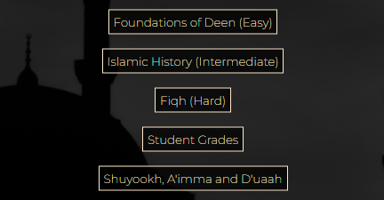
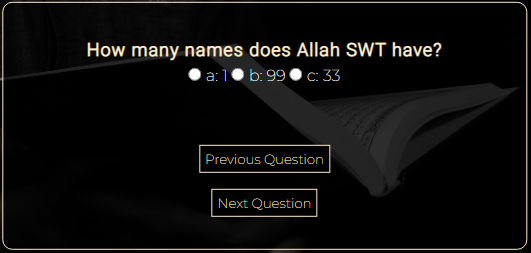
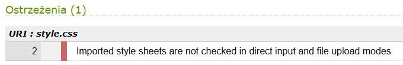
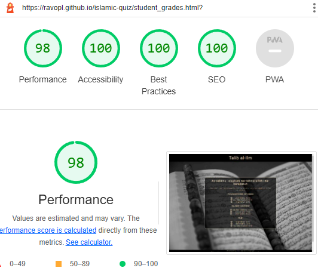

# Talib al-Ilm
Developed by **Dorian Wolarz**, a Code Institute Student

[LINK TO LIVE WEBPAGE](https://ravopl.github.io/islamic-quiz/)

## Contents

1. [Project Goals](#project-goals)
    - [User Goals](#user-goals)
    - [Site Owner Goals](#site-owner-goals)
2. [User Experience](#user-experience)
    - [Target Audience](#target-audience)
    - [User Requirements and Expectations](#user-requirements-and-expectations)
    - [User Stories and Demands](#user-stories-and-demands)
       - [First-time User](#first-time-user)
       - [Returning User](#returning-user)
       - [Webpage Owner](#webpage-owner)
3. [Design of the Website](#design-of-the-website)
    - [Design Choices](#design-choices)
    - [Colour and Fonts](#colour-and-fonts)
    - [Structure](#structure)
    - [Wireframes](#wireframes)
4. [Technologies Used](#technologies-used)
    - [Languages](#languages)
    - [Tools and Websites](#tools-and-websites)
5. [Features](#features)
    - [Main Header and Logo](#main-header-and-logo)
    - [Background Images](#background-images)
    - [Index Box](#index-box)
    - [Collapsible Section](#collapsible-section)
    - [Box Buttons](#box-buttons)
    - [Quiz Sections](#quiz-sections)
    - [Grading Sections](#grading-sections)
    - [Student Grades Section](#student-grades-section)
    - [Scholars Section](#scholars-section)
    - [Footer](#footer)
6. [Testing of the Webpage](#testing-of-the-webpage)
    - [HTML Validation](#html-validation)
    - [CSS Validation](#css-validation)
    - [Accessibility](#accessibility)
    - [Performance](#performance)
    - [Testing of User, Returning User and Webpage Owner Stories](#testing-of-user-returning-user-and-webpage-owner-stories)
7. [Known Bugs](#known-bugs)
8. [Deployment](#deployment)
9. [Credits](#credits)
    - [Media](#media)
    - [Code and Assets](#code-and-assets)

## Project Goals

### User Goals

* Test my knowledge of the religion.
* Easily navigate across a clean user interface.
* Play an interactive quiz of varying difficulty.
* Challenge myself to beat my high score and in turn learn more about the topic I'm being quizzed on.

### Site Owner Goals

* Promote Islam and the correct understanding of the religion among Muslims and non-Muslims alike.
* Provide a way for the student or new user to contact the author with active links on the footer.
* Provide essential and up to date information during the quiz so that the user is aware of his or her progress status.
* Ensure that students can further expand their knowledge by making an easily accessible list of shuyookh, a'imma and du'aah.

## User Experience

### Target Audience

* Knowledgeable Muslims wanting to test their knowledge of the religion.
* Laymen Muslims wanting to expand their knowledge through a fun, challenging and fully interactive quiz.
* Non-Muslims looking to learn more about Islam and test their current knowledge.

### User Requirements and Expectations

* A well structured, user-friendly and efficient webpage.
* Simple and intuitive navigation system.
* A glitchless experience with features that work properly.
* A challenging, fun and fully interactive quiz of varying difficulty on various topics related to the religion.
* A level of accessibility for students and new users with disabilities.
* Resources, links and channels of reputable teachers that can help answer the questions on the webpage and expand the knowledge of a motivated student.

### User Stories and Demands

#### First-time User

1. As a completely new user and non-Muslim I want to understand what the website is about and what I can expect to be tested on.
2. As a new user I want to know how to play the quiz.
3. I'd like to easily navigate across a clean and friendly user interface.
4. I'd like to have the option to contact the author of the webpage on his socials for any inquiries or potential problems.
5. I want to access the leaderboards and see who I'm squaring up against before I commit.
6. As a first time user and a layman Muslim I'd like to test my knowledge on the foundations of the religion to refresh my memory.

#### Returning User

7. As a returning user and a student of knowledge, I'd like to access the leaderboards and see if anyone has gotten ahead of me since I last played.
8. As a returning user I'd like to test myself on an intermediate difficulty topic, such as Islamic history.
9. As a returning user and a dedicated student of knowledge, I'd like to test my wits in a difficult quiz, such as the intricacies of Furu al-Fiqh.
10. I'd like to contact the webpage creator through his socials in order to give him some of my ideas for improvements to the website.
11. I'd like to refresh my memory on how to play the game as I haven't been on the website in a few weeks.
12. I want to see a list of reputable scholars, imams and speakers to take from and improve my previous high score.

#### Webpage Owner

13. As the owner of the website, I want the users to have an easy way to contact me with any queries through the hyperlink-based icons to my socials in the footer of the website.
14. I want the students to compete against each other in all three quizzes and, as such, I'd like to have a leaderboard for every difficulty of the game.
15. I'd like the users to have a good experience viewing the webpage, so I'd like to make sure the website follows good UX design principles, is easy on the eyes and incorporates full interactivity of each page and button.

## Design of the Website

### Design Choices

The webpage was designed with the concept of an Islamic center of education in mind, hence its name - *'Talib al-Ilm'* which translates to *'Student of Knowledge'*. The chosen artistic direction is meant to be clean, organized and easily navigable. The content of the webpage is neatly divided between collapsible and interactive buttons as well as a point-and-click quiz to make the experience easy on experienced and inexperienced web users.

### Colour and Fonts

Colour tones associated with Islam were chosen as basis for the colour palette of the webpage. As such, the main colour is black, which has been reported to be worn in many authentic ahadith by the Prophet Muhammad SAW and the Sahaba. Despite white being the second most authentic colour of Islam, I opted for *"Blanched Almond"* and *"Bisque"* to be the secondary colours, as this combination is more pleasing to the eye and still invokes feelings of Islam and many masajid in the Muslim world. Nevertheless, I also decided to include small hints of white, specifically in the quiz questions, to pay homage to that fact. For the fonts I chose Robot and Montserrat because they effectively compliment one another and are very clean. Sans-Serif was chosen as the backup font in case the previous two refuse to load because it's a basic font that should display without any issues on all devices and software.

### Structure

The website is structured in a user friendly way that makes navigation of its contents extremely easy and makes it pleasing to the eye. The *Home Page* serves as the central hub of the design, allowing for quick access to other sections of the project through fully interactive buttons. Available quizzes are stored in the *Foundations of Deen*, *Islamic History* and *Fiqh* pages. The grades for enrolled students are in *Student Grades* and a list of reputable scholars, imams and speakers is provided in the *Shuyookh, A'imma and Du'aah* section. As such, the website consists of five separate pages:
* **The Home Page**, with its selection of buttons and a collapsible section which explains how to use the webpage
* **Foundations of Deen**, with its easy difficulty ten question quiz on the foundations of the religion
* **Islamic History**, with its intermediate difficulty twenty question quiz on the history of Islam and Muslims
* **Fiqh**, with its hard difficulty ten question quiz on the ins and outs of Islamic jurisprudence
* **Student Grades**, with its list of enrolled students to compare yourself to once you get your grade
* **Shuyookh, A'imma and Du'aah**, with its selection of reputable scholars, imams and speakers.

### Wireframes

  
Home Page

  

  
Quiz in Progress

  

  
Quiz Finished

  

  
Student Grades Page

  

  
Shuyookh, A'imma and Du'aah Page

  

## Technologies Used

### Languages

* HTML
* CSS
* Javascript

### Tools and Websites

* Git
* GitHub
* GitPod
* Google Fonts
* Coolors
* Adobe Photoshop
* Balsamiq

## Features

The website consists of 5 pages and 10 features

### Main Header and Logo
* Featured on all five separate pages of the website
* Fully responsive, changes size according to the dimensions of the display on a particular device
* Allows the user to quickly return to the index of the webpage
* **Stories covered:** 3, 15
 

### Background Images
* Featured on all five separate pages of the website
* Fully responsive, changes size according to the dimensions of the display on a particular device
* Visually appealing, it helps break up the monotony of the text on the website
* Alternates between two relevant photos of specific dimensions depending on whether you view the webpage on a personal computer or a hand-held device
* **Stories covered:** 15
 

### Index Box
* Serves as the central hub for all navigation on the website
* It allows users to acquaint themselves with features of the webpage
* **Stories covered:** 1, 3, 15
 

### Collapsible Section
* Highly informative section of the main page that provides the visitor with all the necessary information on the functionality of the webpage
* Fully interactive and possible to fold and unfold its content as the user sees fit
* **Stories covered:** 1, 2, 3, 11
 

### Box Buttons
* Interactive buttons within the index box of the home page that allow for easy access to all of the website's features
* Aesthetically pleasing and made to suit the design and colour scheme
* **Stories covered:** 5, 6, 7, 8, 9, 12, 14
 

### Quiz Sections
* Fully interactive buttons within the index box that allow the user to move forward or back with the questions being asked
* Interactive selection of each answer that allows for later adjustments and changes
* Clear and easily readable questions and answers that follow the established artistic direction of the website
* **Stories covered:** 3, 6, 8, 9, 14
 

### Grading Sections
* Allows quiz takers to see their full score at the end of every quiz
* Every question is highlighted in red or green depending on result
* Students can go back over their answers and see what they got wrong which aids in memorization and an improvement in overall grades
* **Stories covered:** 3, 6, 8, 9, 14
 

### Student Grades Section
* Provides new and returning students with pre-established grades to compare themselves to
* Neatly divided into sections and stylized with crescents, it is clear on the eye and fits the artistic design of the project
* **Stories covered:** 5, 7, 14
 

### Scholars Section
* Provides new and returning students with a list of reputable scholars, imams and speakers to take from
* Broadens the horizons of both Muslims and non-Muslims alike
* **Stories covered:** 12
 

### Footer
* Provides the users with some relevant information on the author
* Thanks the students for visiting the webpage and playing the quizzes
* Invites users and students to contact the author on provided socials
* **Stories covered:** 4, 10, 13
 

### Features Left to Implement

In the future I plan on adding a fully dynamic student grades system to function as an authentic leaderboard where you can input your results, which I couldn't do now as I ran out of time with my project. I've also been considering adding a descrete music player to be activated by the user that would play authentic Islamic anasheed with vocals only.

## Testing of the Webpage

### HTML Validation

  
Home Page

  

  
Foundations of Deen Quiz

  

  
Islamic History Quiz

  

  
Fiqh Quiz

  

  
Student Grades Page

  

  
Scholars Page

  

### CSS Validation

  
style.css

  
  

### JavaScript Validation

  
Collapsible

  

  
Foundations of Deen Quiz

  

  
Islamic History Quiz

  

  
Fiqh Quiz

  

### Accessibility

  
Home Page

  

  
Foundations of Deen Quiz

  

  
Islamic History Quiz

  

  
Fiqh Quiz

  

  
Student Grades Page

  

  
Scholars Page

  

### Performance

  
Home Page

  

  
Foundations of Deen Quiz

  

  
Islamic History Quiz

  

  
Fiqh Quiz

  

  
Student Grades Page

  

  
Scholars Page

  

### Testing of User, Returning User and Webpage Owner Stories

 

1. *As a completely new user and non-Muslim I want to understand what the website is about and what I can expect to be tested on.*

| **Feature**  | **Expected Result** | **Action Taken** | **Result** |
| ------------- | ------------- | ------------- | ------------- |
| Index Box | Familiarize yourself with webpage content | Navigate to the center of the home page and look within the index box | Works as Intended |
| Collapsible Section | Familiarize yourself with detailed descriptions of site features | Navigate to the index box and click the 'How to Use the Website' button | Works as Intended |

 

2. *As a new user I want to know how to play the quiz.*

| **Feature**  | **Expected Result** | **Action Taken** | **Result** |
| ------------- | ------------- | ------------- | ------------- |
| Collapsible Section | Familiarize yourself with detailed descriptions of site features | Navigate to the index box and click the 'How to Use the Website' button | Works as Intended |

 

3. *I'd like to easily navigate across a clean and friendly user interface.*

| **Feature**  | **Expected Result** | **Action Taken** | **Result** |
| ------------- | ------------- | ------------- | ------------- |
| Main Header and Logo | Click the header logo to return to the home page | Locate the header logo and click on it with the left mouse button | Works as Intended |
| Index Box | Familiarize yourself with webpage content | Navigate to the center of the home page and look within the index box | Works as Intended |
| Collapsible Section | Familiarize yourself with detailed descriptions of site features | Navigate to the index box and click the 'How to Use the Website' button | Works as Intended |
| Quiz Sections | Click the provided buttons to interact with the quiz | Click 'Previous/Next Question' to move across the question set, click the white dots to select your answer | Works as Intended |
| Grading Sections | Click to grade your quiz attempt | Locate the 'Submit Quiz for Grading' button and click it with the left mouse button to receive your score and have your answers highlighted | Works as Intended |

 

4. *I'd like to have the option to contact the author of the webpage on his socials for any inquiries or potential problems.*

| **Feature**  | **Expected Result** | **Action Taken** | **Result** |
| ------------- | ------------- | ------------- | ------------- |
| Footer | Locate and click on socials | Scroll down to the bottom of the page and left click on either of the social media icons | Works as Intended |

 

5. *I want to access the leaderboards and see who I'm squaring up against before I commit.*

| **Feature**  | **Expected Result** | **Action Taken** | **Result** |
| ------------- | ------------- | ------------- | ------------- |
| Box Buttons | Locate the grades section | Click the 'Student Grades' interactive button | Works as Intended |
| Student Grades Section | Locate the grades | Navigate to the center of the page and analyze the grades within the box | Works as Intended |

 

6. *As a first time user and a layman Muslim I'd like to test my knowledge on the foundations of the religion to refresh my memory.*

| **Feature**  | **Expected Result** | **Action Taken** | **Result** |
| ------------- | ------------- | ------------- | ------------- |
| Box Buttons | Locate the Foundations of Deen quiz | Navigate to the center of the home page and left click the 'Foundations of Deen' interactive button | Works as Intended |
| Quiz Sections | Click the provided buttons to interact with the quiz | Click 'Previous/Next Question' to move across the question set, click the white dots to select your answer | Works as Intended |
| Grading Sections | Click to grade your quiz attempt | Locate the 'Submit Quiz for Grading' button and click it with the left mouse button to receive your score and have your answers highlighted | Works as Intended |

 

7. *As a returning user and a student of knowledge, I'd like to access the leaderboards and see if anyone has gotten ahead of me since I last played.*

| **Feature**  | **Expected Result** | **Action Taken** | **Result** |
| ------------- | ------------- | ------------- | ------------- |
| Box Buttons | Locate the grades section | Click the 'Student Grades' interactive button | Works as Intended |
| Student Grades Section | Locate the grades | Navigate to the center of the page and analyze the grades within the box | Works as Intended |

 

8. *As a returning user I'd like to test myself on an intermediate difficulty topic, such as Islamic history.*

| **Feature**  | **Expected Result** | **Action Taken** | **Result** |
| ------------- | ------------- | ------------- | ------------- |
| Box Buttons | Locate the Islamic History quiz | Navigate to the center of the home page and left click the 'Islamic History' interactive button | Works as Intended |
| Quiz Sections | Click the provided buttons to interact with the quiz | Click 'Previous/Next Question' to move across the question set, click the white dots to select your answer | Works as Intended |
| Grading Sections | Click to grade your quiz attempt | Locate the 'Submit Quiz for Grading' button and click it with the left mouse button to receive your score and have your answers highlighted | Works as Intended |

 

9. *As a returning user and a dedicated student of knowledge, I'd like to test my wits in a difficult quiz, such as the intricacies of Furu al-Fiqh.*

| **Feature**  | **Expected Result** | **Action Taken** | **Result** |
| ------------- | ------------- | ------------- | ------------- |
| Box Buttons | Locate the Fiqh quiz | Navigate to the center of the home page and left click the 'Fiqh' interactive button | Works as Intended |
| Quiz Sections | Click the provided buttons to interact with the quiz | Click 'Previous/Next Question' to move across the question set, click the white dots to select your answer | Works as Intended |
| Grading Sections | Click to grade your quiz attempt | Locate the 'Submit Quiz for Grading' button and click it with the left mouse button to receive your score and have your answers highlighted | Works as Intended |

 

10. *I'd like to contact the webpage creator through his socials in order to give him some of my ideas for improvements to the website.*

| **Feature**  | **Expected Result** | **Action Taken** | **Result** |
| ------------- | ------------- | ------------- | ------------- |
| Footer | Locate and click on socials | Scroll down to the bottom of the page and left click on either of the social media icons | Works as Intended |

 

11. *I'd like to refresh my memory on how to play the game as I haven't been on the website in a few weeks.*

| **Feature**  | **Expected Result** | **Action Taken** | **Result** |
| ------------- | ------------- | ------------- | ------------- |
| Collapsible Section | Familiarize yourself with detailed descriptions of site features | Navigate to the index box and click the 'How to Use the Website' button | Works as Intended |

 

12. *I want to see a list of reputable scholars, imams and speakers to take from and improve my previous high score.*

| **Feature**  | **Expected Result** | **Action Taken** | **Result** |
| ------------- | ------------- | ------------- | ------------- |
| Box Buttons | Locate the scholars section | Click the 'Shuyookh A'imma and Du'aah' interactive button | Works as Intended |

 

13. *As the owner of the website, I want the users to have an easy way to contact me with any queries through the hyperlink-based icons to my socials in the footer of the website.*

| **Feature**  | **Expected Result** | **Action Taken** | **Result** |
| ------------- | ------------- | ------------- | ------------- |
| Footer | Locate and click on socials | Scroll down to the bottom of the page and left click on either of the social media icons | Works as Intended |

 

14. *I want the students to compete against each other in all three quizzes and, as such, I'd like to have a leaderboard for every difficulty of the game.*

| **Feature**  | **Expected Result** | **Action Taken** | **Result** |
| ------------- | ------------- | ------------- | ------------- |
| Box Buttons | Locate the Foundations of Deen quiz | Navigate to the center of the home page and left click the 'Foundations of Deen' interactive button | Works as Intended |
| Box Buttons | Locate the Islamic History quiz | Navigate to the center of the home page and left click the 'Islamic History' interactive button | Works as Intended |
| Box Buttons | Locate the Fiqh quiz | Navigate to the center of the home page and left click the 'Fiqh' interactive button | Works as Intended |
| Quiz Sections | Click the provided buttons to interact with the quiz | Click 'Previous/Next Question' to move across the question set, click the white dots to select your answer | Works as Intended |
| Grading Sections | Click to grade your quiz attempt | Locate the 'Submit Quiz for Grading' button and click it with the left mouse button to receive your score and have your answers highlighted | Works as Intended |
| Box Buttons | Locate the grades section | Click the 'Student Grades' interactive button | Works as Intended |
| Student Grades Section | Locate the grades | Navigate to the center of the page and analyze the grades within the box | Works as Intended |

 

15. *I'd like the users to have a good experience viewing the webpage, so I'd like to make sure the website follows good UX design principles, is easy on the eyes and incorporates full interactivity of each page and button.*

| **Feature**  | **Expected Result** | **Action Taken** | **Result** |
| ------------- | ------------- | ------------- | ------------- |
| Main Header and Logo | Click the header logo to return to the home page | Locate the header logo and click on it with the left mouse button | Works as Intended |
| Background Images | Switch the backgrounds | Navigate to different sections of the page to see the backgrounds change, you can also use a smaller device or viewport to see a different image | Works as Intended |
| Index Box | Familiarize yourself with webpage content | Navigate to the center of the home page and look within the index box | Works as Intended |

## Known Bugs

### Unfixed Bugs

| Encountered Bug | Potential Fix |
| ------------- |:-------------:|
| Collapsible text goes over the footer if opened on some devices | Reduce the collapsible in size at a certain resolution |

### Fixed Bugs

| Encountered Bug | The Fix Used |
| ------------- |:-------------:|
| Footer icons not sticking under the text | Positioned the footer and li child to relative position |
| Background image stretching itself to poor quality | Applied background-size cover and background-position center |
| Widescreen background images cropping awfully on smaller devices | Media max-width 700 and a set of new background images with correct dimensions specifically for smaller devices |

## Deployment

The website was deployed using GitHub Pages by following these steps:

1. In your GitHub repository navigate to the *Settings* tab
2. In the menu on the left hand side select *Pages*
3. For the source of your repo select *branch: main*
4. After the webpage refreshes, you will see a ribbon on the top saying: *"Your site is published at https://ravopl.github.io/islamic-quiz/"*

You can for fork the repository by following these steps:

1. Go to the GitHub repository
2. Click on Fork button in upper right hand corner

You can clone the repository by following these steps:

1. Go to the GitHub repository
2. Locate the Code button above the list of files and click on it
3. Select if you prefer to clone using HTTPS, SSH or GitHub CLI and click the copy button to copy the URL to your clipboard
4. Open GitBash
5. Change the current directory to the one you previously cloned
6. Type git clone and paste the URL from the clipboard ($ git clone https://github.com/YOUR-USERNAME/YOUR-REPOSITORY)
7. Press 'Enter' to create your local clone

## Credits

### Media

* [bckg-index.jpg by crossingilandmono](https://crossingilandmono.tumblr.com/post/94134417843/minaret-moon)
* [bckg-index2.jpg by miroha and Wallpaper Abyss](https://wall.alphacoders.com/big.php?i=1114313)
* [bckg-scholars.jpg by Wallpaper Flare](https://www.wallpaperflare.com/quran-read-islam-muslim-arabic-book-allah-prayer-time-wallpaper-ajuju)
* [bckg-scholars2.jpg by Wallpaper Flare](https://www.wallpaperflare.com/morocco-casablanca-hassan-ii-mosque-marocco-muslim-muslims-wallpaper-ervjt)
* [bckg-deen.jpg by Masjid Pogung Dalangan on Unsplash](https://unsplash.com/photos/DBsQFuIbXg4)
* [bckg-deen2.jpg by Wallpaper Flare](https://www.wallpaperflare.com/masjid-nabawi-i-ve-to-medina-minaret-architecture-religion-wallpaper-ehjug)
* [bckg-history.jpg by Levi Meir Clancy on Unsplash](https://unsplash.com/photos/Y2oE2uNLSrs)
* [bckg-history2.jpg by Daniel Burka on Unsplash](https://unsplash.com/photos/oR9ZisoF_NE)
* [bckg-fiqh.jpg by Nazreen Banu on Unsplash](https://unsplash.com/photos/BDYxMbCNs8c)
* [bckg-fiqh2.jpg by Ahmet Kagan Hancer on Unsplash](https://unsplash.com/photos/FFhJCVaFuO0)
* [bckg-grades.jpg by GR Stocks on Unsplash](https://unsplash.com/photos/3enqRtcWYzs)
* [bckg-grades2.jpg by Fatih Yurur on Unsplash](https://unsplash.com/photos/kNSREmtaGOE)

### Code and Assets
* *'Love Running'* Essentials Project by Code Institute
* [Font Awesome 5 Icons by W3Schools, imported to make use of Facebook logo in the Footer](https://www.w3schools.com/icons/fontawesome5_intro.asp)
* [Collapsible Box Code by W3Schools](https://www.w3schools.com/howto/howto_js_collapsible.asp)
* [JavaScript Simple Quiz by Sitepoint](https://www.sitepoint.com/simple-javascript-quiz/)
