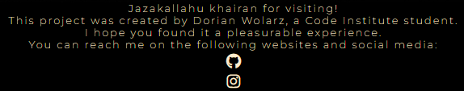

# Talib al-Ilm
Developed by **Dorian Wolarz**, a Code Institute Student

[LINK TO LIVE WEBPAGE](https://ravopl.github.io/narrows-portaferry/)

## Contents

1. [Project Goals](#project-goals)
    - [User Goals](#user-goals)
    - [Site Owner Goals](#site-owner-goals)
2. [User Experience](#user-experience)
    - [Target Audience](#target-audience)
    - [User Requirements and Expectations](#user-requirements-and-expectations)
    - [User Stories and Demands](#user-stories-and-demands)
       - [First-time User](#first-time-user)
       - [Returning User](#returning-user)
       - [Webpage Owner](#webpage-owner)
3. [Design of the Website](#design-of-the-website)
    - [Design Choices](#design-choices)
    - [Colour and Fonts](#colour-and-fonts)
    - [Structure](#structure)
    - [Wireframes](#wireframes)
4. [Technologies Used](#technologies-used)
    - [Languages](#languages)
    - [Tools and Websites](#tools-and-websites)
5. [Features](#features)
    - [Logo and Navigation Bar](#logo-and-navigation-bar)
    - [Main Banner Image](#main-banner-image)
    - [About Us Section](#about-us-section)
    - [Special Offers Section](#special-offers-section)
    - [Special Events Section](#special-events-section)
    - [Online Reservations Form](#online-reservations-form)
    - [Google Maps Section](#google-maps-section)
    - [Menu Section](#menu-section)
    - [Amenities Section](#amenities-section)
    - [Gallery Section](#gallery-section)
    - [Footer](#footer-section)
6. [Testing of the Webpage](#testing-of-the-webpage)
    - [HTML Validation](#html-validation)
    - [CSS Validation](#css-validation)
    - [Accessibility](#accessibility)
    - [Performance](#performance)
    - [Testing of Customer, Returning Customer and Webpage Owner Stories](#testing-of-customer-returning-customer-and-webpage-owner-stories)
7. [Known Bugs](#known-bugs)
8. [Deployment](#deployment)
9. [Credits](#credits)
    - [Media](#media)
    - [Code and Assets](#code-and-assets)

## Project Goals

### User Goals

* Test my knowledge of the religion.
* Easily navigate across a clean user interface.
* Play an interactive quiz of varying difficulty.
* Challenge myself to beat my high score and in turn learn more about the topic I'm being quizzed on.

### Site Owner Goals

* Promote Islam and the correct understanding of the religion among Muslims and non-Muslims alike.
* Provide a way for the student or new user to contact the author with active links on the footer.
* Provide essential and up to date information during the quiz so that the user is aware of his or her progress status.
* Ensure that students can further expand their knowledge by making an easily accessible list of shuyookh, a'imma and du'aah.

## User Experience

### Target Audience

* Knowledgeable Muslims wanting to test their knowledge of the religion.
* Laymen Muslims wanting to expand their knowledge through a fun, challenging and fully interactive quiz.
* Non-Muslims looking to learn more about Islam and test their current knowledge.

### User Requirements and Expectations

* A well structured, user-friendly and efficient webpage.
* Simple and intuitive navigation system.
* A glitchless experience with features that work properly.
* A challenging, fun and fully interactive quiz of varying difficulty on various topics related to the religion.
* A level of accessibility for students and new users with disabilities.
* Resources, links and channels of reputable teachers that can help answer the questions on the webpage and expand the knowledge of a motivated student.

### User Stories and Demands

#### First-time User

1. As a completely new user and non-Muslim I want to understand what the website is about and what I can expect to be tested on.
2. As a new user I want to know how to play the quiz.
3. I'd like to easily navigate across a clean and friendly user interface.
4. I'd like to have the option to contact the author of the webpage on his socials for any inquiries or potential problems.
5. I want to access the leaderboards and see who I'm squaring up against before I commit.
6. As a first time user and a layman Muslim I'd like to test my knowledge on the foundations of the religion to refresh my memory.

#### Returning User

7. As a returning user and a student of knowledge, I'd like to access the leaderboards and see if anyone has gotten ahead of me since I last played.
8. As a returning user I'd like to test myself on an intermediate difficulty topic, such as Islamic history.
9. As a returning user and a dedicated student of knowledge, I'd like to test my wits in a difficult quiz, such as the intricacies of Furu al-Fiqh.
10. I'd like to contact the webpage creator through his socials in order to give him some of my ideas for improvements to the website.
11. I'd like to refresh my memory on how to play the game as I haven't been on the website in a few weeks.
12. I want to see a list of reputable scholars, imams and speakers to take from and improve my previous high score.

#### Webpage Owner

13. As the owner of the website, I want the users to have an easy way to contact me with any queries through the hyperlink-based icons to my socials in the footer of the website.
14. I want the students to compete against each other in all three quizzes and, as such, I'd like to have a leaderboard for every difficulty of the game.
15. I'd like the users to have a good experience viewing the webpage, so I'd like to make sure the website follows good UX design principles, is easy on the eyes and incorporates full interactivity of each page and button.

## Design of the Website

### Design Choices

The webpage was designed with the idea of a seaside marina restaurant in mind. The general aesthetic of the website is meant to be clean, organized and easily navigatable. The content of the webpage is neatly divided among sections and sub-sections to make the experience easy on the customer.

### Colour and Fonts

Colour tones associated with the sea were chosen as basis for the colour palette of the webpage as the website is meant to emulate the vibe of a seaside marina. As such, the main colour is turquoise and the font colour is navy, which works well with the restaurant logo as well. For the fonts I chose Open Sans and Source Sans Pro from Google Fonts because they compliment one another very effectively. Arial was chosen as the backup font in case the previous two refuse to load because it's a neat, basic font that will display without any issues on all devices and software.

### Structure

The website is structured in a user friendly way that makes navigation of its contents extremely easy and pleasing to the eye. The most vital of information which can be stored on one page (*Home, About and Contact*) is done so through a hyperlink connection and relevant information in the webpage's footer section. Other equally vital information which need its own respective pages are stored in the *Gallery* and *Menu and Amenities* pages. As such, the website consists of three separate pages:
* **The Home Page**, with its About and Contact sections down the bottom of the page which can be accessed with just one click
* **The Gallery Page**, with its responsive gallery to enhance a customer's experience and give a glimpse into the restaurant facilities
* **The Menu and Amenities Page**, which stores both the menu and the room rental sections

### Wireframes

  
Home Page

  

  
Quiz in Progress

  

  
Quiz Finished

  

  
Student Grades Page

  

  
Shuyookh, A'imma and Du'aah Page

  

## Technologies Used

### Languages

* HTML
* CSS
* Javascript

### Tools and Websites

* Git
* GitHub
* GitPod
* Google Fonts
* Adobe Color
* Adobe Photoshop
* Balsamiq

## Features

The website consists of X pages and Y features

### Logo and Navigation Bar
* Featured on all three separate pages of the website
* Fully responsive, changes size according to the dimensions of the display on a particular device
* The page the user is currently on is highlighted with an underscore styling
* Allows customer for quick and easy navigation of all three separate pages on the website as well as specific sections of the Home page
 

### Main Banner Image
* Featured on all three separate pages of the website
* Fully responsive, changes size according to the dimensions of the display on a particular device
* Visually appealing, it helps divide up the text on the webpage into easily digestible portions
* Displays a specific photo associated with 'The Narrows' restaurant for visual significance
 

### About Us Section
* It provides a description of the business and staff as well as some bits of history
* **Stories covered:** 5, 17
 

### Special Offers Section
* Highly informative section of the main page that grants the user news of currently ongoing special offers
* Divided by narrow images, it easily 'pops' into view and attracts a customer's attention
* **Stories covered:** 2, 3, 8, 17
 

### Special Events Section
* Highly informative section of the main page that provides the customer with the sort of public and private events that 'The Narrows' can accommodate
* **Stories covered:** 3, 17
 

### Online Reservations Form
* Crucial part of the Home page that allows new and returning customers to make orders without the need to have a dedicated account
* Allows new and returning customers to contact the owner directly without having to resort to e-mail communication
* **Stories covered:** 4, 12, 15, 16
 

### Google Maps Section
* Allows new customers to locate the restaurant
* Allows new and returning customers to scout for points of interest in the surrounding area without having to open another tab
* **Stories covered:** 1, 6
 

### Menu Section
* Provides new and returning customers with an up to date main menu, with accurate names, prices and descriptions
* Informs new and returning customers of the variaties of the main menu depending on time of day
* **Stories covered:** 2, 11, 17
 

### Amenities Section
* Provides new and returning customers with an up to date list of available room rentals
* Informs new and returning customers of the differences in each available bed and breakfast option
* **Stories covered:** 7, 14
 

### Gallery Section
* Provides new and returning customers with a visually appealing and responsive assortment of relevant photos
* **Stories covered:** 14
 

### Footer
* Informs new and returning customers of up to date opening times
* Provides new and returning customers with the restaurant's location, phone number as well as e-mail address
* Invites new and returning customers to visit the social media of the business
* **Stories covered:** 1, 3, 9, 10, 13, 15
 

### Features Left to Implement

In the future I plan on adding a dynamic user review section that displays customer reviews, a carousel for banner images, resize various aspects of the webpage to fit better on-screen and look cleaner, as well as create separate pages for the Contact and About Us buttons in the navigation bar

## Testing of the Webpage

### HTML Validation

  
Home Page

  

  
Gallery Page

  

  
Menu and Amenities Page

  

### CSS Validation

  
style.css

  
  

### Accessibility

  
Home Page

  

  
Gallery Page

  

  
Menu and Amenities Page

  

### Performance

  
Home Page

  

  
Gallery Page

  

  
Menu and Amenities Page

  

### Testing of Customer, Returning Customer and Webpage Owner Stories

1. *As a new user I want to know where exactly the restaurant is located.*
 

| **Feature**  | **Expected Result** | **Action Taken** | **Result** |
| ------------- | ------------- | ------------- | ------------- |
| Google Maps frame | Locate a mini frame showing accurate location of restaurant  | Navigate to 'Contact' in the nav bar, see Google Maps frame | Works as Intended |
| Restaurant location in Footer | Locate the listed restaurant location in the footer  | Navigate to 'Contact' in the nav bar, see Footer on the bottom | Works as Intended |

2. *I want to know the price range so I can compare it with other restaurants in the area.*
 

| **Feature**  | **Expected Result** | **Action Taken** | **Result** |
| ------------- | ------------- | ------------- | ------------- |
| Special Offers section | Locate Special Offers section showing up to date specials | Scroll down the bottom of the Home page, see Special Offers | Works as Intended |
| Menu section | Locate up to date Main Menu meals | Navigate to 'Menu and Amenities' page, scroll down to Menu section | Works as Intended |

3. *I'd like to know more about the hours of opening, the special offers and the catering for special events.*
 

| **Feature**  | **Expected Result** | **Action Taken** | **Result** |
| ------------- | ------------- | ------------- | ------------- |
| Special Offers section | Locate Special Offers section showing up to date specials | Scroll down the bottom of the Home page, see Special Offers | Works as Intended |
| Special Events section | Locate Special Events section showing events catering | Scroll down the bottom of the Home page, see Special Events | Works as Intended |
| Information in Footer | Locate opening times listing in the Footer | Scroll down the bottom of the Home page, see opening times in Footer | Works as Intended |

4. *I'd want to be able to make orders from the webpage without having to make a separate account.*
 

| **Feature**  | **Expected Result** | **Action Taken** | **Result** |
| ------------- | ------------- | ------------- | ------------- |
| Online Reservation form | Locate and submit an Online Reservation form | Click 'Contact' and scroll to the Online Reservation form, fill it out | Works as Intended |

5. *I want to know more about the restaurant and the people that work there.*
 

| **Feature**  | **Expected Result** | **Action Taken** | **Result** |
| ------------- | ------------- | ------------- | ------------- |
| About Us section | Locate About Us section providing information about the business | Click 'About' and read the section | Works as Intended |

6. *I'd love to know about any points of interest close to the restaurant's accommodation.*
 

| **Feature**  | **Expected Result** | **Action Taken** | **Result** |
| ------------- | ------------- | ------------- | ------------- |
| Google Maps frame | Locate a mini frame showing nearby points of interest | Navigate to 'Contact' in the nav bar, see Google Maps frame | Works as Intended |

7. *I'd like to see what bed and breakfast options are available in the establishment.*
 

| **Feature**  | **Expected Result** | **Action Taken** | **Result** |
| ------------- | ------------- | ------------- | ------------- |
| Amenities section | Locate up to date Amenities section showing accommodation | Navigate to 'Menu and Amenities' in the nav bar, scroll to 'Amenities' section | Works as Intended |

8. *As a returning customer, I'd like to see an expanded list of special offers.*
 

| **Feature**  | **Expected Result** | **Action Taken** | **Result** |
| ------------- | ------------- | ------------- | ------------- |
| Special Offers section | Locate Special Offers section showing up to date specials | Scroll down the bottom of the Home page, see Special Offers | Works as Intended |

9. *As a returning customer I want to know the changed opening hours.*
 

| **Feature**  | **Expected Result** | **Action Taken** | **Result** |
| ------------- | ------------- | ------------- | ------------- |
| Information in Footer | Locate the opening hours listing in the Footer | Scroll down the bottom of the Home page, see opening hours in Footer | Works as Intended |

10. *As a returning customer I'd like to find the phone number to make reservations.*
 

| **Feature**  | **Expected Result** | **Action Taken** | **Result** |
| ------------- | ------------- | ------------- | ------------- |
| Information in Footer | Locate the provided phone number in the Footer | Scroll down the bottom of the Home page, see phone number in Footer | Works as Intended |

11. *I'd like to see the menu, with a clear pricing list and names of dishes.*
 

| **Feature**  | **Expected Result** | **Action Taken** | **Result** |
| ------------- | ------------- | ------------- | ------------- |
| Menu section | Locate up to date Main Menu meals | Navigate to 'Menu and Amenities' page, scroll down to Menu section | Works as Intended |

12. *I want to make orders without having to make a separate account just for this purpose.*
 

| **Feature**  | **Expected Result** | **Action Taken** | **Result** |
| ------------- | ------------- | ------------- | ------------- |
| Online Reservation form | Locate and submit an Online Reservation form | Click 'Contact' and scroll to the Online Reservation form, fill it out | Works as Intended |

13. *I would want to find clickable icons to access social media.*
 

| **Feature**  | **Expected Result** | **Action Taken** | **Result** |
| ------------- | ------------- | ------------- | ------------- |
| Information in Footer | Locate the social media hyperlink in the Footer | Scroll down the bottom of the Home page, see 'Find Us On' section in Footer | Works as Intended |

14. *I'd like to see a gallery of relevant photos so I can see the facilities in the establishment.*
 

| **Feature**  | **Expected Result** | **Action Taken** | **Result** |
| ------------- | ------------- | ------------- | ------------- |
| Gallery section | Locate and assess the Photo Gallery | Click 'Gallery' page in the navigation bar, scroll down | Works as Intended |

15. *As the owner of the website, I want the customers to have an easy way to contact us.*
 

| **Feature**  | **Expected Result** | **Action Taken** | **Result** |
| ------------- | ------------- | ------------- | ------------- |
| Online Reservation form | Communicate with website owner through reservation form | Click 'Contact' and scroll to the Online Reservation form, fill it out | Works as Intended |
| Information in Footer | Locate the social media hyperlink in the Footer | Scroll down the bottom of the Home page, see 'Find Us On' section in Footer | Works as Intended |
| Information in Footer | Locate the provided phone number in the Footer | Scroll down the bottom of the Home page, see phone number in Footer | Works as Intended |

16. *I want the customers to have an easy access to on-webpage ordering, so that orders can be forwarded to us without any issues and without the need to make personal accounts to be held in our database.*
 

| **Feature**  | **Expected Result** | **Action Taken** | **Result** |
| ------------- | ------------- | ------------- | ------------- |
| Online Reservation form | Locate and submit an Online Reservation form without having to make a dedicated account | Click 'Contact' and scroll to the Online Reservation form, fill it out and submit | Works as Intended |

17. *I'd like the users to have a good experience viewing the webpage and getting to know our menu, special offers, special events and a little bit about us as a company and brand.*
 

| **Feature**  | **Expected Result** | **Action Taken** | **Result** |
| ------------- | ------------- | ------------- | ------------- |
| Menu section | Locate up to date Main Menu meals | Navigate to 'Menu and Amenities' page, scroll down to Menu section | Works as Intended |
| Special Offers section | Locate Special Offers section showing up to date specials | Scroll down the bottom of the Home page, see Special Offers | Works as Intended |
| Special Events section | Locate Special Events section showing events catering | Scroll down the bottom of the Home page, see Special Events | Works as Intended |
| About Us section | Locate About Us section providing information about the business | Click 'About' and read the section | Works as Intended |

## Known Bugs

### Unfixed Bugs

| Encountered Bug | Potential Fix |
| ------------- |:-------------:|
| Google Maps window always adjusting to full width of display | Reduce values of vh and vw |

### Fixed Bugs

| Encountered Bug | The Fix Used |
| ------------- |:-------------:|
| Online Reservation Form not downsizing below a certain dimension size | Enveloped code in @media tag and styled it to a relative position, 80% of width and a height value of auto|
| Footer stretching the page dimensions above a desired size | Enveloped code in @media tag and styled it to reduced font size below 700px while giving margins value of 0 |
| Header not keeping a rigid form | Wrapped navbar into a div class and styled it within a @media query below 700px to keep text aligned, set width to 400 and keep a line height of 2em |

## Deployment

The website was deployed using GitHub Pages by following these steps:

1. In your GitHub repository navigate to the *Settings* tab
2. In the menu on the left hand side select *Pages*
3. For the source of your repo select *branch: main*
4. After the webpage refreshes, you will see a ribbon on the top saying: *"Your site is published at https://ravopl.github.io/islamic-quiz/"*

You can for fork the repository by following these steps:

1. Go to the GitHub repository
2. Click on Fork button in upper right hand corner

You can clone the repository by following these steps:

1. Go to the GitHub repository
2. Locate the Code button above the list of files and click on it
3. Select if you prefer to clone using HTTPS, SSH or GitHub CLI and click the copy button to copy the URL to your clipboard
4. Open GitBash
5. Change the current directory to the one you previously cloned
6. Type git clone and paste the URL from the clipboard ($ git clone https://github.com/YOUR-USERNAME/YOUR-REPOSITORY)
7. Press 'Enter' to create your local clone

## Credits

### Media

* [bckg-index.jpg by crossingilandmono](https://crossingilandmono.tumblr.com/post/94134417843/minaret-moon)
* [bckg-index2.jpg by miroha and Wallpaper Abyss](https://wall.alphacoders.com/big.php?i=1114313)
* [bckg-scholars.jpg by Wallpaper Flare](https://www.wallpaperflare.com/quran-read-islam-muslim-arabic-book-allah-prayer-time-wallpaper-ajuju)
* [bckg-scholars2.jpg by Wallpaper Flare](https://www.wallpaperflare.com/morocco-casablanca-hassan-ii-mosque-marocco-muslim-muslims-wallpaper-ervjt)
* [bckg-deen.jpg by Masjid Pogung Dalangan on Unsplash](https://unsplash.com/photos/DBsQFuIbXg4)
* [bckg-deen2.jpg by Wallpaper Flare](https://www.wallpaperflare.com/masjid-nabawi-i-ve-to-medina-minaret-architecture-religion-wallpaper-ehjug)
* [bckg-history.jpg by Levi Meir Clancy on Unsplash](https://unsplash.com/photos/Y2oE2uNLSrs)
* [bckg-history2.jpg by Daniel Burka on Unsplash](https://unsplash.com/photos/oR9ZisoF_NE)

### Code and Assets
* [Font Awesome 5 Icons by W3Schools, imported to make use of Facebook logo in the Footer](https://www.w3schools.com/icons/fontawesome5_intro.asp)
* [Collapsible Box Code by W3Schools](https://www.w3schools.com/howto/howto_js_collapsible.asp)